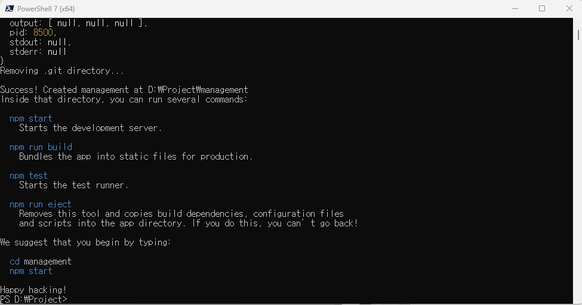
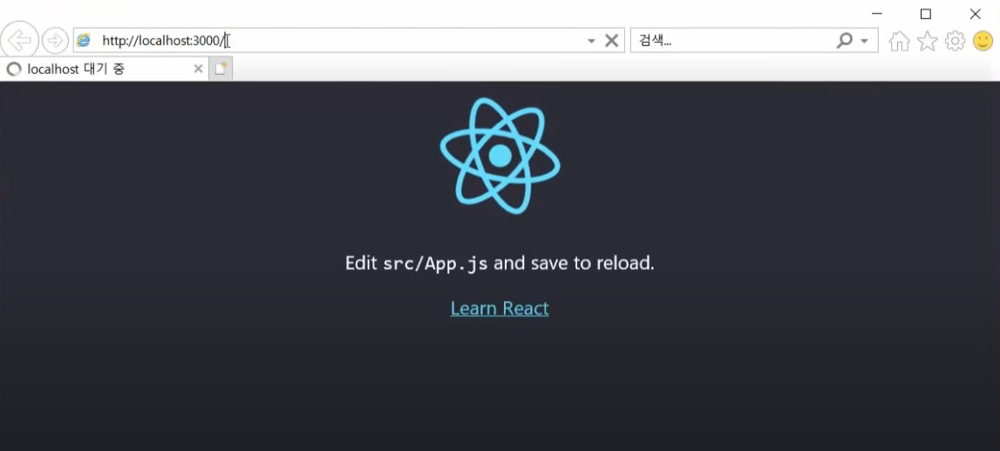
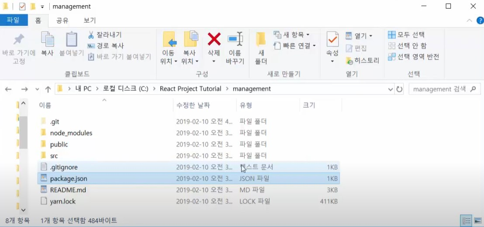
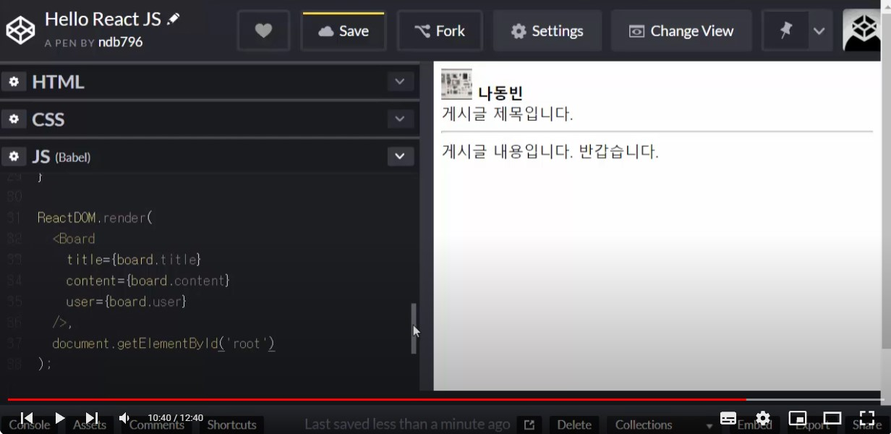
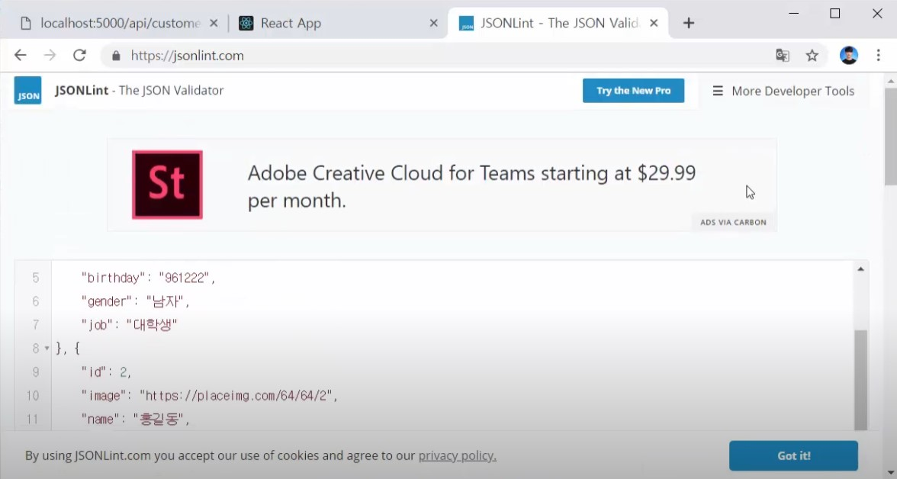
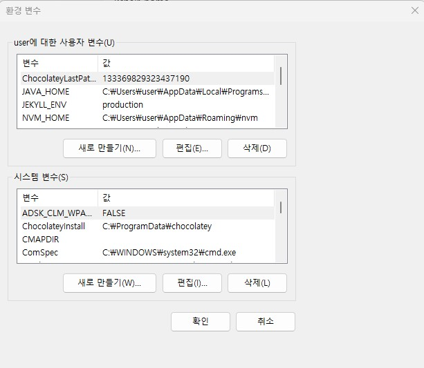
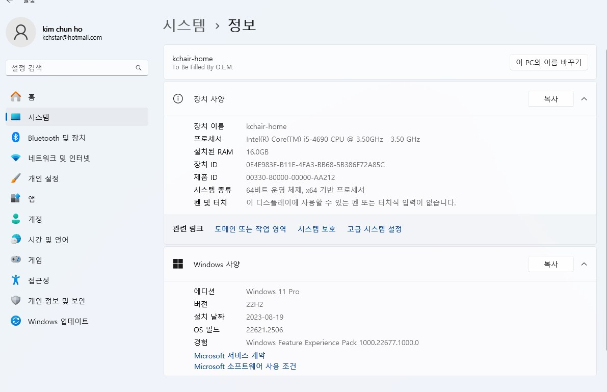

$ node -v 20.10.0
$ npm -v 10.2.3

***  한글 folder ***
# 1강 
## React App Server구동시키기 위하여 
    Node.js install 
    $ node -v
    $ npm 

$ npm install -g create-react-app
j:\project> $ create-react-app management
c:\react project Tutorial> $ create-react-app management 

    react모듈에는 다양한 모듈을 포함하고 있다. 
$ dir -> $cd managment >$yarn start
    만약? > npm install -g yarn
# React app을 정삭적으로 동작시키기 위하여 yarn start

# 2강
## vsc install 

$ npm install -D yarn
$ yarn start

# 3강
commit(stage에 올려서 ) -> Create React Project
## 우선 local저장소에 commit하기위해서 전부 이름을붙여서(Create React Project) stage에 올려준다. 
0. git init
## push하기 위해서 terminal창으로 이동한다. 
PS D:\Project\management> git remote add origin https://github.com/kchair777/React-Management-Tutorial.git
PS D:\Project\management> git push --set-upstream origin master

# 4강

## faild to compile
## props (프롭스)는 property(속성)의 약자이다. 
## HTML
    

## JavaScript
    function Show(props){
        return(
            <h3>
            Name is {props.name}
            </h3>
        );
    }
    const element = <Show name="김천호"/>;
    ReactDOM.render(element,
    document.getElementById('root'));
    // Show.defaultProps = {
        name: '홍길동'
    }
    --- 
    ReactDOM.render(
        <Board
        title={board.title}
        content={board.content}
        user={board.user}
        />.
        document.getElementById('root')
    );

# 5강
## 컴퍼넌트의 분리하면 생산성향상
customer.js
    class Customer extends React.Component {
        render(){
            return(
            
   
            <CustomerProfile id={this.props.id} image={this.props.image} name={this.props.name} />
            <CustomerInfo birthday={this.props.birthday} gender={this.props.gender} job={this.props.job} />
            

            )        
        }
    }
App.js
    class App extends Component {  // 그려지게 될 최소단위 
    render(){
        return(
        

        {customers.map(c => { return( <Customer key={c.id} id={c.id} image={c.image} name={c.name} birthday={c.birthday} gender={c.gender} job={c.job} /> ); }) }
        

        );
  }
}

# 6강
## material-ul는 React에서 강력하다.

$ npm install @material-ui/core (x)
$ npm install @mui/material @emotion/react @emotion/styled
[안되면](https://velog.io/@keonu05/nth-check-2.0.1)

https://jsonlint.com에서 json형식인지를 확인한다.

$ yarn add @material-ui/core@next

# 7강

# 8강
$ yarn dev 서버와 클라이언드를 구동시킨다.
$ npm install -g yarn = 사용자가 바뀌게 되면 다시설치 
$ yarn dev = 실행이 안되면 
$ npm install --save package.json

## rest Api
## parser(문장 구조 분석. 오류 점검 프로그램)
## deprecated(반대하다)
## vulnerable(취약한)

## react에서는 비동기 통신

package.json
    "proxy": "https://localhost:5000/"

App.js 아래내용을 삭제한다
    const customer = {
    'name': '홍길동',
    'birthday': '970707',
    'gender':  '남자',
    'job': '대학생'
}

